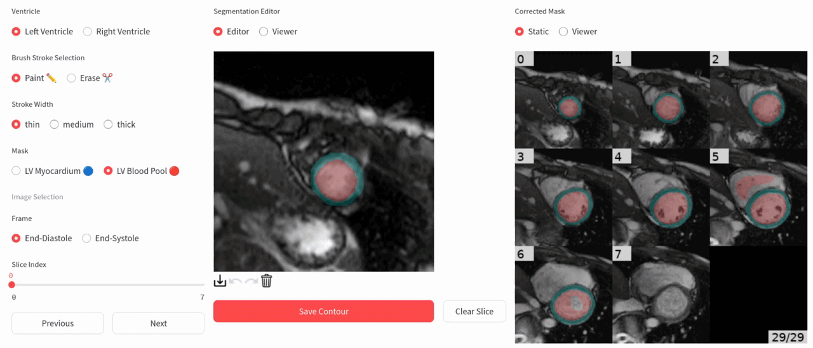

# Roundel Biventricular

Short-Axis Segementation App.





---

## Data Structure

```
data/
└── {subfolder_name}/
    ├── image___{pat_id}.nii.gz
    ├── mask___{pat_id}.nii.gz
    └── sax_df___{pat_id}.csv
```

---

## File Descriptions

### `image___{pat_id}.nii.gz`

NIfTI image file for a single patient.
Shape: `(H, W, D, T)`

* `H`: height
* `W`: width
* `D`: slice index
* `T`: time frame

### `mask___{pat_id}.nii.gz`

Segmentation mask corresponding to the image.
Shape: `(H, W, D, T)`
Spatial and temporal dimensions match the image exactly.

### `sax_df___{pat_id}.csv`

CSV file containing acquisition metadata.

#### Columns

* `pixelspacing`
* `thickness`

#### Example

```
pixelspacing,thickness
1,8
```
